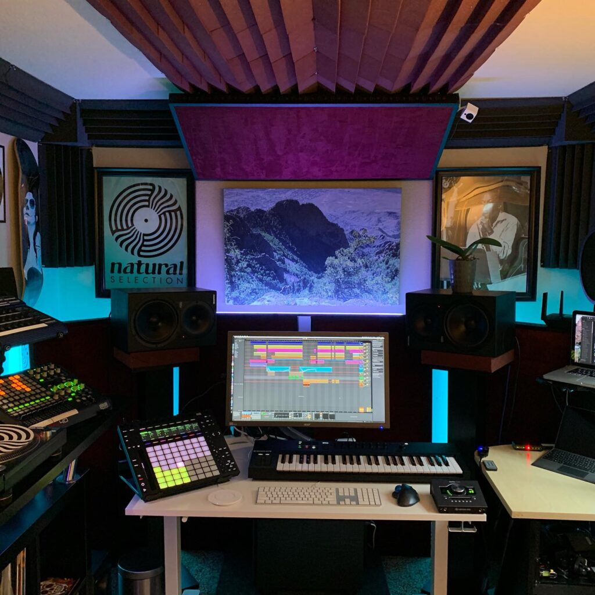
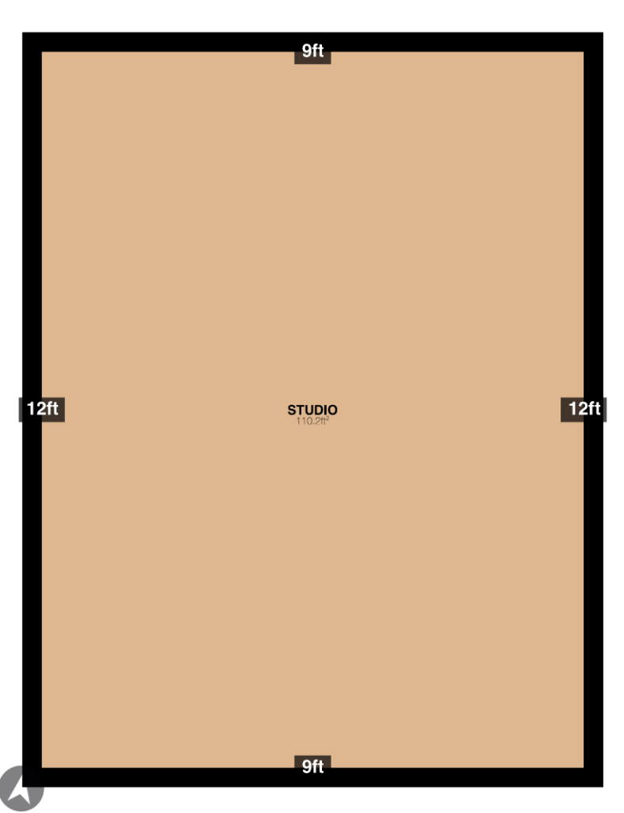
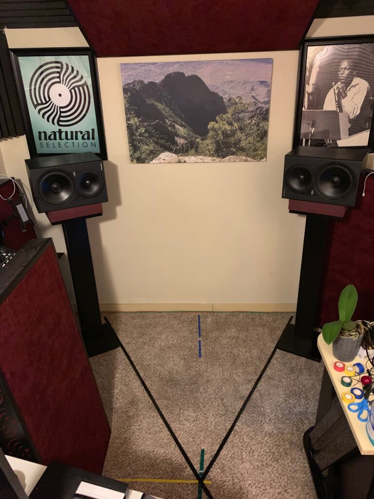
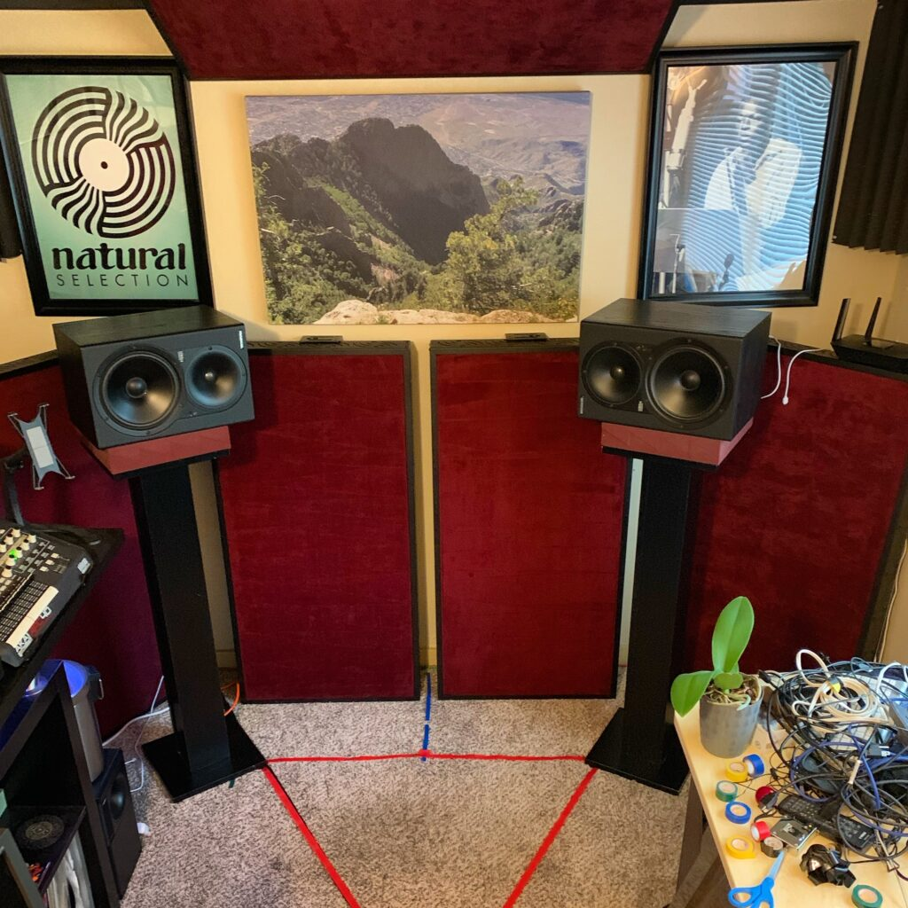

#### Monitor Placement Study

Compromises are a part of life, and the best strategy is not to avoid them, but to make ones that give you the most benefit, for the least tradeoff. There are so many incredible producers out there, and a lot don't have the resources to design a critical listening room from scratch. This study details monitor placement, and acoustical treatment, of a rectangular apartment bedroom, which is being devoted fully to music production, mastering, and DJing.

The theoretical 'sweet spot' of a listening position in a room, proposed by Wes Lachot, is at 38% the length of the room, in the center of the width of the room. The tweeters of the monitors should also be in an equilateral triangle with the listening position. These should not be compromised, and if possible, the highest priority.

Another thing that cannot be compromised, is that the monitors should not be close to the walls. If that's not possible, some monitors have eq profiles that reduces the effect of the wall. Creating an equilateral triangle from the listening position, which was calculated to be 54.72", for a length of 144", to wall, gives us an idea of each monitor tweeter's path to the wall, and let's us start to move them towards or away from the listening position, to find a good medium of where the monitors should be, in respect to the wall, and the other furniture and equipment. This is when the compromises start.

Accounting for the desk dimensions, and location of the office chair at the sweet spot, an equilateral triangle with the tweeters was dimensioned.

Bass traps were utilized for the front two corners, and due to the bedroom entrance, and utility closet, placing bass traps in the rear two corners wasn't feasible, so those two were placed at the front of the listening position. The bass traps are made from rigid fiberglass, with rock wool being a cheaper alternative. The concept is that there are very small air bubbles in the fiberglass, that vibrate in response to sound waves passing through them, bouncing off the wall, and passing back through. The vibration of the air bubbles converts the energy in the sound waves to heat, thereby reducing the sound that is reflected back to the listener.

The thicker the stack of rigid fiberglass, the more the reduction of low end reflections. Mid-High frequency control panels can be made with less thickness. Rigid fiberglass panels are the most effect forms of acoustic treatment, however anything is better than nothing, and foam can help a room a lot. In this studio, The Natural Selection Lab, foam is being slowly phased out with panels.

#### References

Discussion on finding the sweet spot in the room

[https://www.gearslutz.com/board/studio-building-acoustics/681979-finding-sweet-spot-room.html](https://www.gearslutz.com/board/studio-building-acoustics/681979-finding-sweet-spot-room.html)

Room Monitor Placement

[http://arqen.com/acoustics-101/room-setup-speaker-placement/](http://arqen.com/acoustics-101/room-setup-speaker-placement/)

Equilateral Triangles Calculator

[https://www.calculatorsoup.com/calculators/geometry-plane/triangles-equilateral.php](https://www.calculatorsoup.com/calculators/geometry-plane/triangles-equilateral.php)

Acoustic Treatment Resources

[https://realtraps.com/art\_basics.htm](https://realtraps.com/art_basics.htm)
